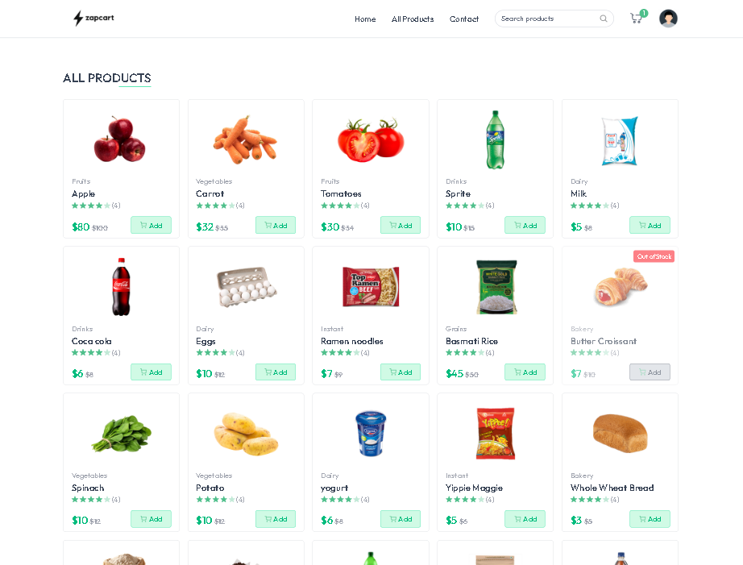
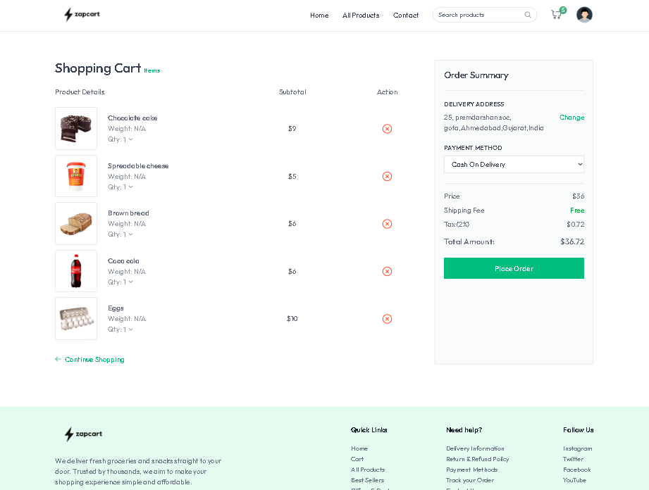
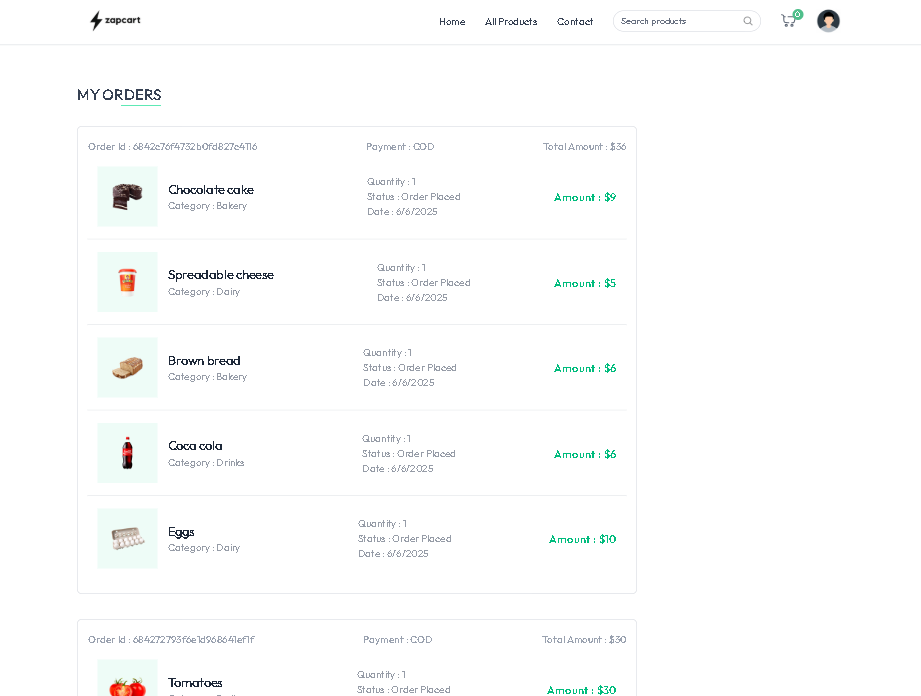
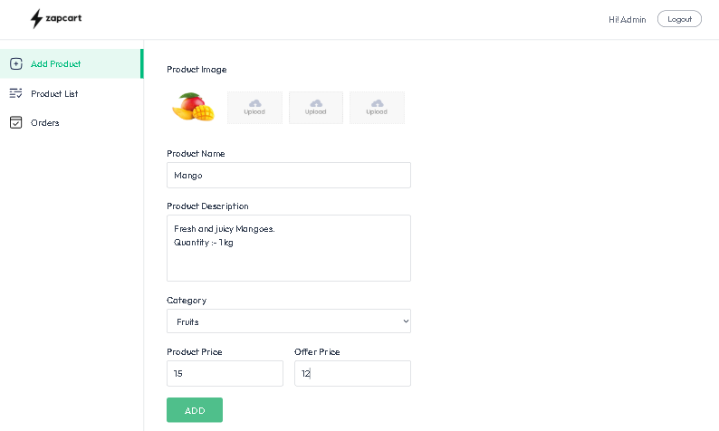
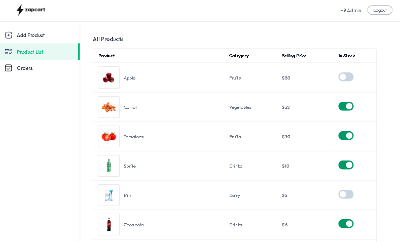
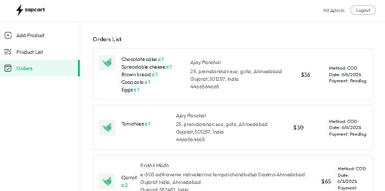

# ⚡ ZapCart – MERN E-commerce Web App

ZapCart is a fully functional e-commerce platform built using the **MERN stack**. It features complete user and seller flows, including product listings, cart, checkout (COD + Stripe), authentication, and order management.

---

## 🔗 Live Preview

> 🖥️ [Click here to visit the live site](https://zapcart-mu.vercel.app/)  
> 🚀 This project is private on GitHub, but you can view the full working site via the live deployment link.

---

## 📸 Screenshots

### 🏠 Homepage

### 🛍️ All Products Page

### 🛒 Cart Page

### 📦 My Orders Page

### ➕ Seller – Add Product

### 📋 Seller – Product List

### 📦 Seller – Order List

---

## 💻 Features

### 👤 User:
- Register/login with JWT-based auth
- Browse products and add to cart
- Place orders with COD or Stripe
- View past orders

### 🧑‍💼 Seller:
- Login as seller
- Add/edit products
- View orders placed by users

---

## 🛠️ Tech Stack

| Frontend        | Backend        | Database | Auth | Payment | Hosting |
|------------------|----------------|----------|------|---------|----------|
| React + Tailwind | Node.js + Express | MongoDB | JWT | Stripe | Vercel (Frontend + Backend) |

> 🔁 State management handled using **React Context API**.

---

## 🙋‍♂️ Author & Credit

Made with 💙 by [**Aadarsh Sharma**](https://github.com/Aadarsh-2003)  
> 🧠 **Credit:** This project was built by following the YouTube tutorial by [GreatStack](https://www.youtube.com/watch?v=PaQX0pktLnw).  
> All code was written from scratch while learning. The original paid source code was not copied or reused.

---

> ⭐ If you like this project or learned something from it, feel free to connect or give it a star (privately)!

